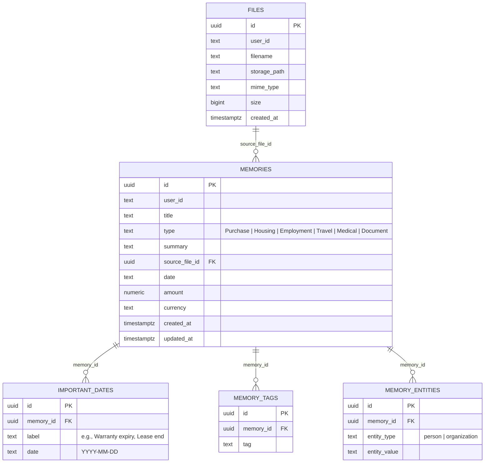

# MEMORA — Architecture, Tech Stack & Product Vision

> **Intimate Personal Knowledge & Document Archive**  
> *"Drop something you don't want to forget — retrieve it with verified truth."*

---

## 1. What Are We Building?

**Memora** is an intelligent, privacy-first **personal document vault and life memory archive** (a *"Second Brain for Real Life"*).

### The Problem We Solve
People constantly accumulate critical documents throughout life:
- Hardware purchases & invoices (with warranty periods and repair slips)
- Rental & lease agreements (security deposits, landlord contacts, expiration dates)
- Employment contracts & internship agreements (stipends, IP clauses, start dates)
- Travel confirmations (flight tickets, boarding tokens, hotel bookings)
- Medical records, insurance policies, and official identity documents

Today, this critical information is scattered across Gmail attachments, WhatsApp chats, Google Drive folders, and desktop download directories. When you need to know *"When does my laptop warranty expire?"* or *"How much security deposit did I pay for the apartment?"*, you end up spending 20 minutes digging through folders and reading PDF fine print.

### How Memora Solves It
1. **Effortless Ingestion**: Simply drop or upload any document (PDF, PNG, JPG, WebP).
2. **Autonomous Fact Extraction**: The engine reads the document, extracts key facts, monetary amounts, currencies, organizations, people, and critical future deadlines.
3. **Verified Knowledge Q&A**: Ask natural language questions in a Google-like conversational bar and get direct, grounded answers backed by source citations.
4. **Proactive Milestones ("To Remember Soon")**: An automated countdown dashboard for warranties expiring, leases renewing, or policies ending.
5. **Interactive Chronological Timeline & Vault**: A visual, organized archive of life's records with full document inspection.

---

## 2. What Are We Using? (Tech Stack & Architecture)

| Layer | Technologies | Purpose / Rationale |
| :--- | :--- | :--- |
| **Framework** | **Next.js 16.3.5 (App Router, Turbopack)** | Full-stack React framework with server-side API routes and client interactivity. |
| **Frontend Library** | **React 19.2.8 & TypeScript 5** | High-performance component rendering with strict type safety across data contracts. |
| **Styling & Design System** | **Tailwind CSS v4** | Modern, token-based design system featuring an *Editorial Calm* aesthetic. |
| **Typography** | **Newsreader** (Google Fonts Serif) & **Geist** (Vercel Sans-serif) | Combines archival, humanistic warmth (Newsreader) with clean technical precision (Geist). |
| **AI / Intelligence Engine** | **Google Gemini (`gemini-2.5-flash`)** via `@google/genai` (v2.23.0) | Multimodal document parsing, structured JSON extraction, and zero-hallucination grounded QA. |
| **Primary Database & Storage** | **Supabase (PostgreSQL + Supabase Storage)** | Relational schema (`files`, `memories`, `important_dates`, `memory_tags`, `memory_entities`) and secure object storage. |
| **Offline / Local Fallback** | **Local File-System Store (`.data/memora_store.json` + `.data/uploads/`)** | Zero-dependency developer mode: allows running, testing, and demonstrating without needing immediate cloud credentials. |
| **Search & Retrieval** | **Hybrid Keyword/Token Scoring + LLM Reranking** | Fast in-memory token relevance scoring followed by Gemini context verification. |
| **Icons** | **Google Material Symbols Outlined** | Crisp, minimalist iconography for document types, actions, and status indicators. |

---

## 3. Database Schema & Data Models

The data architecture is defined in [supabase/schema.sql](file:///d:/Memora/Memora/memora/supabase/schema.sql) and mirrored in TypeScript types:

---

## 4. Key Application Features

### 🔍 1. Verified Knowledge Engine (Grounded Q&A)
- Natural language questions such as:
  - *"When does my laptop warranty expire?"*
  - *"How much deposit did I pay for the apartment?"*
  - *"What is my flight seat number to San Francisco?"*
- Answers are verified strictly against retrieved documents. If the information does not exist, the engine transparently states it cannot be found instead of hallucinating.
- Shows latency (e.g. `12ms` or cached), source document badge, highlighted key date, and clickable related memory chips.

### ⏱️ 2. "To Remember Soon" (Proactive Milestone Tracking)
- Automatically computes relative deadlines (e.g., `28 days left`, `43 days`, `2 years`).
- Visual urgency indicators alerting the user before a warranty lapses or an agreement expires.

### 📁 3. Calm, Multi-Stage Upload Experience
- Drag-and-drop file upload zone.
- Visual state transitions reflecting human comprehension:
  `Uploading...` ➔ `Reading...` ➔ `Understanding...` ➔ `Extracting...` ➔ `Saved to Vault`.

### 📜 4. Chronological Timeline & Source Inspector
- Switch between **Memory View** and **Timeline View** to see personal history unfold chronologically.
- Clicking any memory opens the **Document Viewer Modal** showing extracted summaries, dates, monetary values, organizations, people, tags, and a link to view/download the original file.

### ⌨️ 5. Keyboard Navigation & Preferences
- `Cmd + K` or `Ctrl + K`: Instantly focus search.
- `Escape`: Dismiss any modal or inspection view.
- Vault preferences to customize the vault name (e.g. *"Julian's Vault"*).

---

## 5. Our Final Outcome (Target Product Vision)

When this project reaches its final production state, the user will experience:

1. **A Complete Personal Memory Operating System**:
   - Every life paper, agreement, and purchase is converted into a structured, searchable, semantic graph.
2. **Zero Manual Tagging or Filing Required**:
   - The user never has to organize folders, rename files, or manually fill in spreadsheet rows. AI handles 100% of the extraction and categorisation.
3. **Instant Factual Clarity**:
   - Total confidence when dealing with warranty claims, landlord disputes, tax records, or employment paperwork.
4. **Proactive Notifications / Alerts**:
   - (Future Roadmap) Web push notifications or email digests 30 days before critical deadlines (e.g., insurance renewals, warranty expirations).
5. **End-to-End Privacy & Portability**:
   - Cloud backup via Supabase with one-click JSON/CSV data export and complete user ownership.
