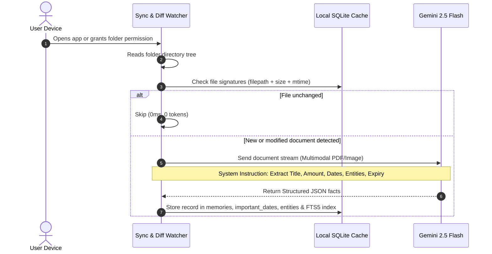
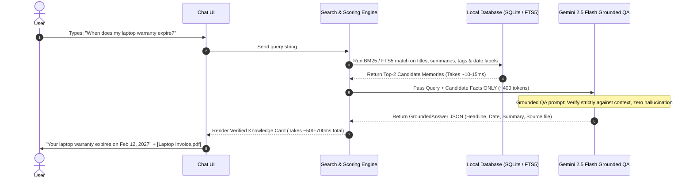

# MEMORA — End-to-End System Architecture

> **System Architecture**: Zero-Upload, Privacy-First, Native-Bridged Personal Document Intelligence & Instant Q&A Engine.

---

## 1. High-Level Architecture Blueprint

```
+----------------------------------------------------------------------------------------------------+
|                                     CLIENT APPLICATION LAYER                                       |
|                                                                                                    |
|  [ Chat & Query Bar ]    [ Verified Knowledge ]    [ "To Remember Soon" ]    [ Timeline & Viewer ] |
+----------------------------------------------------------------------------------------------------+
                                                  |
                                                  v
+----------------------------------------------------------------------------------------------------+
|                                   NATIVE STORAGE BRIDGE LAYER                                      |
|                                                                                                    |
|   Android: Storage Access Framework (SAF)      iOS: UIDocumentPicker       Desktop: Web FileSystem |
|   ACTION_OPEN_DOCUMENT_TREE                     Security-Scoped Bookmarks   showDirectoryPicker()  |
|   Persisted URI Permissions                     Sandbox Scoped Storage      Native Read Stream     |
+----------------------------------------------------------------------------------------------------+
              |                                                                  |
              v (Files Detected / Modified)                                      | (User Query: "When...")
+----------------------------------------------------+      +----------------------------------------+
|       PIPELINE A: BACKGROUND INGESTION ENGINE      |      |     PIPELINE B: INSTANT QUERY ENGINE   |
|                                                    |      |                                        |
|  1. File Watcher & Diff Engine (SHA256 / mtime)    |      |  1. Query Tokenizer & Intent Parser    |
|  2. Document Filter (PDF, JPG, PNG, WebP)          |      |  2. Local Index Lookup (FTS5 + Vector) |
|  3. Extraction Pipeline:                           |      |  3. Top-K Candidate Snippet Scoring    |
|     - Local Fast Text Extraction                   |      |  4. Grounded Context Packager          |
|     - Gemini 2.5 Flash Structured Fact Parser      |      +----------------------------------------+
|  4. Local Graph & Vector Store:                    |                           |
|     - Facts, Amounts, Entities, Milestones         |                           v
+----------------------------------------------------+      +----------------------------------------+
              |                                             |      AI VERIFICATION & GROUNDING       |
              v                                             |                                        |
+----------------------------------------------------+      |  Google Gemini 2.5 Flash Engine        |
|          LOCAL PERSISTENCE & CACHE LAYER           |      |  - Strict Zero-Hallucination System    |
|                                                    |      |  - Extract Primary Citation & Excerpt  |
|  - SQLite (FTS5 Full-Text Search)                  |<---->|  - Underline Target Date / Value       |
|  - Relational Models: Facts, Dates, Entities       |      |  - Output Structured Grounded JSON     |
|  - In-Memory Inverted Index (Fast Cache)           |      +----------------------------------------+
+----------------------------------------------------+                           |
                                                                                 v
                                                                    +------------------------+
                                                                    | Instant Verified Answer|
                                                                    | Latency: < 800ms       |
                                                                    | With Source Citation   |
                                                                    +------------------------+
```

---

## 2. Core Architectural Subsystems

### Subsystem 1: The Native Storage Bridge Layer
Instead of forcing users to upload files one by one, the app requests scoped access to where users already store their life documents (e.g., `Downloads`, `Documents`, or `Invoices`):

- **Android Implementation**:
  - Uses `ACTION_OPEN_DOCUMENT_TREE`.
  - The app executes `contentResolver.takePersistableUriPermission()` so permissions survive phone reboots and app restarts.
  - Documents are queried via `DocumentsContract`.
- **iOS Implementation**:
  - Uses `UIDocumentPickerViewController` configured with `asCopy = false`.
  - The returned directory URL is persisted using `bookmarkDataWithOptions(.withSecurityScope)`.
  - Every access opens via `startAccessingSecurityScopedResource()`.
- **Web / Desktop Implementation**:
  - Uses the W3C `window.showDirectoryPicker()` API with `mode: 'read'`.
  - Stores directory handle in IndexedDB (`idb-keyval`) for instant reconnect.

---

### Subsystem 2: Background Ingestion & Diff Engine (Async Worker)



#### Why this saves tokens & battery:
- **Incremental Ingestion**: Only newly added or changed files are processed.
- **Run Once per Document**: A 5-page lease agreement is analyzed **once**. After extraction, it takes up just ~1 KB in the local database.

---

### Subsystem 3: Instant Query Engine & Grounded Answer (Real-Time)

When a user asks a question in the chat interface:



---

## 3. Data Flow & Schemas

### Structured Memory Record (Local DB / SQLite)
```sql
CREATE TABLE files (
  id TEXT PRIMARY KEY,
  filename TEXT NOT NULL,
  uri TEXT NOT NULL,            -- Local file URI / Content URI
  mime_type TEXT NOT NULL,
  size INTEGER NOT NULL,
  last_modified INTEGER NOT NULL,
  sha256 TEXT NOT NULL
);

CREATE TABLE memories (
  id TEXT PRIMARY KEY,
  source_file_id TEXT REFERENCES files(id),
  title TEXT NOT NULL,
  type TEXT NOT NULL,           -- 'purchase' | 'employment' | 'housing' | 'travel' | 'medical'
  summary TEXT NOT NULL,
  date TEXT,
  amount REAL,
  currency TEXT,
  created_at INTEGER NOT NULL
);

CREATE TABLE important_dates (
  id TEXT PRIMARY KEY,
  memory_id TEXT REFERENCES memories(id) ON DELETE CASCADE,
  label TEXT NOT NULL,          -- e.g. 'Warranty expiry', 'Lease renewal'
  date TEXT NOT NULL            -- YYYY-MM-DD
);

-- Virtual Table for sub-millisecond keyword lookup
CREATE VIRTUAL TABLE memories_fts USING fts5(
  title, summary, tags, date_labels, content='memories'
);
```

### Grounded Answer Schema (What LLM returns to Chat UI)
```typescript
interface GroundedAnswer {
  headline: string;          // Direct 1-sentence answer: "Your laptop warranty expires on February 12, 2027."
  summary: string;           // 1-2 sentences of verified context from document
  highlightedDate?: string;  // "February 12, 2027" (underlined in UI)
  source: {
    filename: string;        // "Laptop Invoice.pdf"
    fileUri: string;         // Local file path to open in viewer
  };
  relatedMemories: string[]; // ["AppleCare+ Receipt", "Laptop Purchase"]
  latencyMs: number;         // e.g. 18ms (local) or 540ms (Gemini)
  isFound: boolean;          // true if found, false if not in documents
}
```

---

## 4. Key Performance & Security Attributes

| Attribute | Specification | Architectural Solution |
| :--- | :--- | :--- |
| **Query Latency** | **< 800ms** | Two-tier retrieval: Local FTS5 lookup (15ms) + Gemini 2.5 Flash streaming/grounding (500ms). |
| **Offline Resilience** | **100% Queryable Offline** | If device has no internet, local keyword matching still returns the exact memory cards and dates from SQLite. |
| **Privacy / Zero Cloud Leakage**| **User Controls Everything** | Raw files never sit permanently on an external server. The files stay on the phone/laptop. Only text snippets are processed for Q&A. |
| **Token Efficiency** | **99% Cost Reduction** | Documents are extracted only once. User queries pass ~400 tokens of pre-extracted structured facts instead of megabytes of raw PDFs. |
| **App Store Compliance** | **Zero Policy Violations** | Uses user-consented Scoped Storage (`ACTION_OPEN_DOCUMENT_TREE` on Android, `UIDocumentPicker` on iOS). Avoids dangerous `MANAGE_EXTERNAL_STORAGE` rejections. |

---

## 5. Technology Stack Mapping

```
+--------------------------------------------------------------------------------+
| COMPONENT                  | RECOMMENDED STACK                                 |
+----------------------------+---------------------------------------------------+
| Cross-Platform Framework   | Capacitor / React Native (or Next.js PWA)         |
| Native File System Bridge  | Android SAF / iOS DocumentPicker / W3C FileSystem |
| Local Storage & Cache      | SQLite + FTS5 Full Text Engine (via op-sqlite)     |
| AI Extraction & Grounding  | Google Gemini 2.5 Flash via @google/genai         |
| UI / Presentation          | React 19, Tailwind CSS v4, Newsreader & Geist     |
+--------------------------------------------------------------------------------+
```
