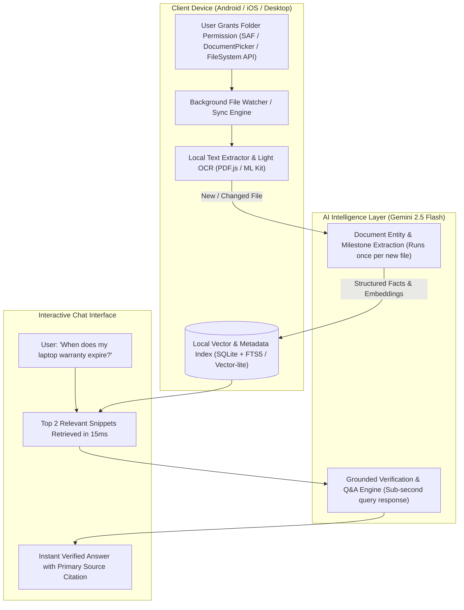

# Zero-Upload Intelligent File Vault — System Architecture

> **Concept**: The user never manually uploads files. Instead, they grant file access (Android/iOS/Desktop), and an intelligent agent indexes their documents locally, answering any query on-demand with grounded citations.

---

## 1. The Big Question: Would It Really Work?

### **Short Answer: YES, absolutely.**
However, **how** you engineer it determines whether it is a blazing-fast magic experience or an unusable battery drain.

### The Naive Approach (Why it FAILS):
If a user asks *"When does my laptop warranty expire?"*, and your app tries to:
1. Open the file manager on the phone
2. Read 500+ raw PDFs and images from scratch
3. Send megabytes of raw files to an LLM at query time

❌ **Why it fails**:
- Latency would be 30–60 seconds per question.
- Token limits and API costs would explode.
- Mobile OS will kill the app for high CPU/RAM usage.
- Battery drain will cause users to uninstall.

---

## 2. The Production Architecture (How It ACTUALLY Works)

To make it return answers **ASAP (under 1 second)**, we use a **Two-Phase Architecture**:

---

## 3. Platform Breakdown & Permissions (The Reality of Android & iOS)

| Platform | Recommended Permission Mechanism | Storage Access Model | UX / Security Consideration |
| :--- | :--- | :--- | :--- |
| **Android** | **Storage Access Framework (SAF)**: `ACTION_OPEN_DOCUMENT_TREE` | User picks folder(s) once (e.g. `Downloads`, `Documents`, or `Invoices`). App retains persistent URI permissions (`takePersistableUriPermission`). | Google Play restricts `MANAGE_EXTERNAL_STORAGE` (All Files). SAF gives full persistent access to chosen folder without policy rejections. |
| **iOS** | **UIDocumentPickerViewController** (`asCopy: false`) with Security-Scoped Bookmarks | User selects an iCloud Drive or local folder once. App persists security-scoped URL bookmark. | iOS strictly sandboxes app storage. Security-scoped bookmarks keep folder accessible across launches. |
| **Desktop / Web (PWA)** | **File System Access API**: `window.showDirectoryPicker()` | User clicks "Connect Folder" once. Chrome/Edge allows persistent read access. | Works out-of-the-box on Desktop; mobile browsers require native wrapper. |

---

## 4. End-to-End Workflow

### Step 1: Permission & Zero-Friction Setup
- On first launch, the app asks:  
  *“Allow Memora to index your Documents or Downloads folder to find answers for you?”*
- The native OS folder picker pops up. User taps their folder. Done.

### Step 2: Background "Smart Snooping" (Incremental Ingestion)
- The app checks for file hashes (`SHA-256` or modification timestamps).
- If a new invoice, agreement, or ticket is found:
  1. The app extracts the text locally or sends the file to **Gemini 2.5 Flash** for structured JSON extraction (Title, Type, Amount, Expiry Dates, Entities).
  2. The structured summary and embedding are saved into the local encrypted SQLite database.
  3. Raw original files stay on the user’s device storage untouched.

### Step 3: Instant Query in Chat ("ASAP" Retrieval)
1. User types in chat: *"What did I pay for the Indiranagar lease?"*
2. **Local Vector / Keyword Filter (15ms)**: Instantly matches the pre-indexed lease record (`mem-3`).
3. **Gemini Grounded Answer (500ms)**: Sends only the targeted lease summary to Gemini Flash with zero-hallucination rules.
4. **Result**:
   > *"You paid ₹60,000 security deposit for the Indiranagar apartment to landlord S. Narayanan on January 15, 2026."*  
   > *[Tap to view Lease_Agreement_Indiranagar.pdf]*

---

## 5. Recommended Native Mobile Stack

To turn this existing Next.js web application into an Android/iOS app with file access:

1. **Option A: Capacitor / Ionic (Fastest Bridge from current codebase)**
   - Wraps the existing Next.js web app into native Android (`.apk`/Play Store) and iOS (`.ipa`/App Store).
   - Use `@capacitor/filesystem` and custom native plugin for Android SAF and iOS Document Picker.
   - Reuses 100% of current React components, Tailwind styling, and Gemini logic.

2. **Option B: React Native / Expo**
   - Use `expo-document-picker` or `react-native-scoped-storage` for Android SAF and `react-native-document-picker` for iOS.
   - Native SQLite (`expo-sqlite` or `react-native-quick-sqlite`) with FTS5 full-text search.

3. **Option C: Desktop App (Tauri / Electron)**
   - If targeting laptops/MacBooks, Tauri provides direct filesystem watcher APIs (`notify` crate) with native speed and zero token overhead.

---

## 6. Summary Verdict

- **Can we build it?** Yes.
- **Will it work?** Yes, by coupling **Native Scoped Storage Permissions (Android SAF / iOS Bookmarks)** with a **Pre-Indexed Local Cache + Gemini 2.5 Flash Grounded QA**.
- **Is it better than manual uploads?** Significantly. It removes 100% of user friction.
